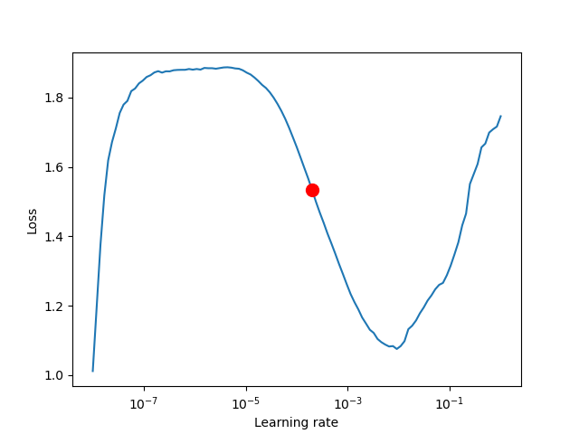
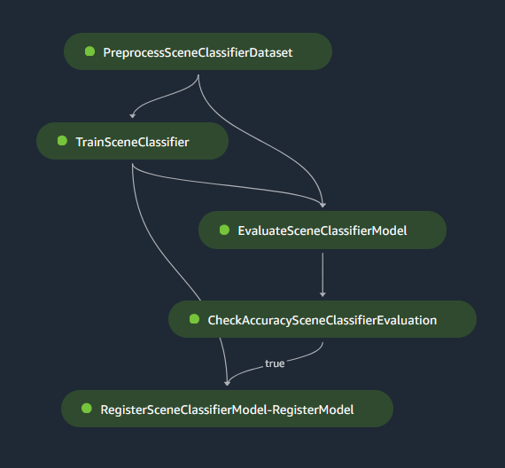
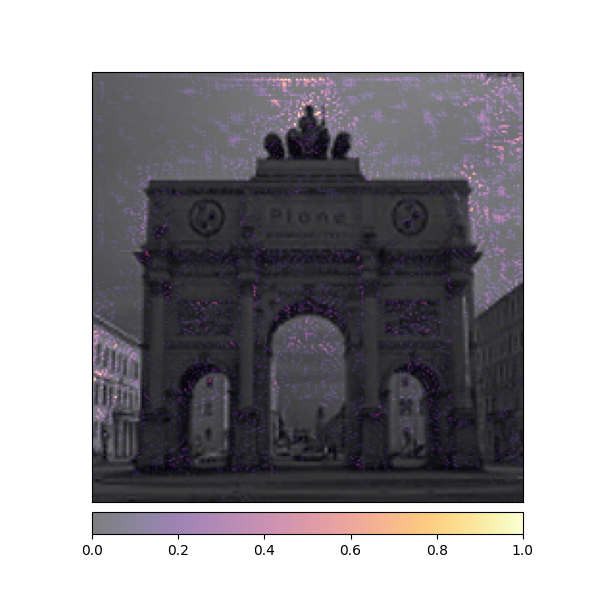
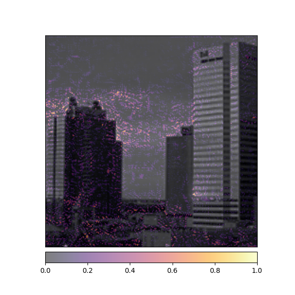
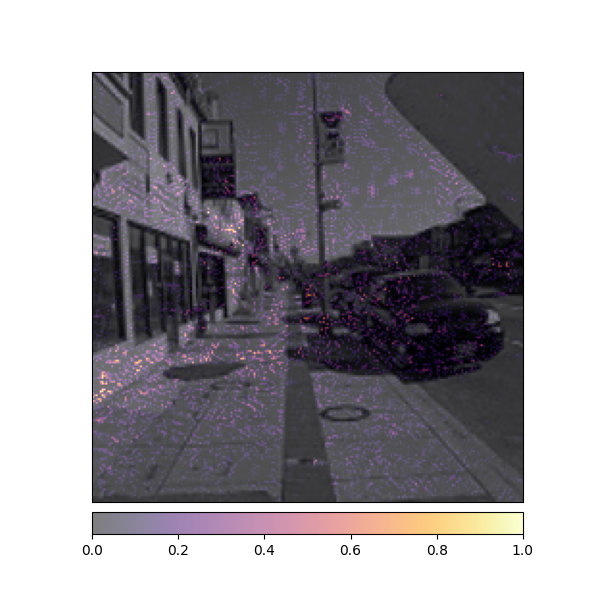

# Project Kidu

> An end to end MLOPs pipeline for Image classification on AWS

Project Kidu aims to set up an end to end pipeline from annotation till deployment for a image classification problem on AWS. The dataset used here is [Intel Image Classification](https://www.kaggle.com/datasets/puneet6060/intel-image-classification). The dataset have 6 classes: \[buildings, forest, glacier, mountain, sea amd street\]. Pre trained models from [Timm](https://github.com/rwightman/pytorch-image-models) are being used here to do the classification. The repo code is code developed using [Pytorch Lightning](https://www.pytorchlightning.ai/) and configurations are done using [Hydra](https://hydra.cc/).

## Hyperparameter Tuning

As a first step, a LR finder is used to find the best initila learning rate. The idea here is that, the learning rate will be changed from a lower value to higher value over the some predefined number of steps and corresponding loss will be noted. The best learning rate would be the one where loss is decreasing the steepest.

The result of the LR finder is shown below. The best learning rate was found to be `0.0002`

<p align="center">
  <br>
  
  <br>
</p>

<!--  -->

In the next step a hyper parameter search was done using [Optuna](https://optuna.org/). The hyper parameters tuned were:

- Model: One among (resnet18, mobilenetv2, spnasnet)
- Optimizer: One among (Adam, SGD, RMSprop)
- Learning rate: In the interval ((0.0002 - 0.0001), (0.0002 + 0.0008))

The evaluation of hyper parameters was based on Model Accuracy on Test Dataset. The result obtained from experiment is as follow:

```yaml
name: optuna
best_params:
  model.net.model_name: spnasnet_100
  model.learning_rate: 0.000497926679863759
  model.optimizer._target_: torch.optim.Adam
best_value: 0.9394463896751404
```

- The tensorboard log for the hyper parameter tuning can be found in this [link](https://tensorboard.dev/experiment/BD4QF8yGTayeP6tY3kLAXw/).
- The notebooks used for the experiment can be found [here](./notebooks/01-hp-tune.ipynb)

## Architecture Diagram

The hyper parameters obtained from previous step was used as the default value to create a end to end pipeline in AWS. The architecture of the pipeline is as shown below:


### Model build Pipeline

As seen from architecture, there are 3 triggers to start model build pipeline

- Commit is made to model build repo
- Raw dataset is uploaded to S3
- Annotations are updated in S3

If any of the above event happens, code pipeline starts which will trigger a code build which in turn trigger the sagemaker pipeline. The sagemaker pipeline looks like this



The sagemaker pipeline can also be started manually by providing the following parameters:

- Model
- Batch Size
- Optimizer
- Learning Rate
- Dataset Location in S3
- Augmentations to use for Training (0 - for default pipeline, 1 - for albumentations pipeline)

The trained model is registered in the model registry only if the accuracy on the test data is greater than 60 percent. Also in the evaluation step, Integrated Gradients method is used for model explainability on some [test images](./tests/resources/intel-scene/).

|  |  |  |
| ------------------------------------------ | ---------------------------------------- | ----------------------------------------- |

- The tensorboard log for sagemaker training can be found [here](https://tensorboard.dev/experiment/fWJb3I99QxC9Caknzdgigg/)
- The source code for model build repo is [here](https://github.com/Project-Kidu/model-build)
- The docker image used for sagemaker training is build using [this](./dockers/train/Dockerfile) file

### Model Deploy Pipeline

The model deploy pipeline will be triggered if

- commit is made to model deploy repo
- model is approved in the model registry

The pipeline will start a code build which will build a cloudformation template using the AWS CDK (which is infrastructure as code package). This cloudformation stack consist of a API gateway and a lambda endpoint. The stack will be deployed into the staging environment and tested for model robustness. The test consist of sending some images with Gaussian noise and blur. If model passes the robustness check, then it waits for approval of the user. Once the model is manually approved, the same stack will be deployed to the production environment.

- Click [here](https://project-kidu-frontend-streamlit-app-gdinr3.streamlit.app/) to checkout the production deployment through a streamlit frontend. The frontend just takes an images, convert it into base64 string and send it to lambda endpoint for predictions.
- Code for streamlit frontend can be found [here](https://github.com/Project-Kidu/frontend)
- Code for lambda function can be found [here](https://github.com/Project-Kidu/lambda-repo)
- Code for model deploy repo can be found [here](https://github.com/Project-Kidu/model-deploy)

### Annotation in Label Studio

Take a portion of the prediction images from the dataset and upload it to S3 bucket. Open Label studio. Add the S3 bucket as input source and add another S3 bucket where annotations will be synced back. Create a ML backend for label studio with Lambda endpoint that we have deployed to production. With this all the images that have to annotated will be pre labelled with predictions from your deployed endpoint. Only the images with wrong pre label have to be corrected and submitted, significantly reducing the labelling time needed. Once annotation is done, sync back the results to S3. This will in turn trigger the model build pipeline, which will now train the model with new images also. This allows for having a retraining pipeline.

- Code for label studio ML backend can be found [here](https://github.com/Project-Kidu/label-studio-ml-backend)

## Workflow Video

To view the video of the entire workflow, click on the below image

[](https://youtu.be/TRcUkOBnEYo)

## References

- https://github.com/ashleve/lightning-hydra-template
- https://towardsdatascience.com/deploying-a-serverless-inference-service-with-amazon-sagemaker-pipelines-2d2f3cc96c39
